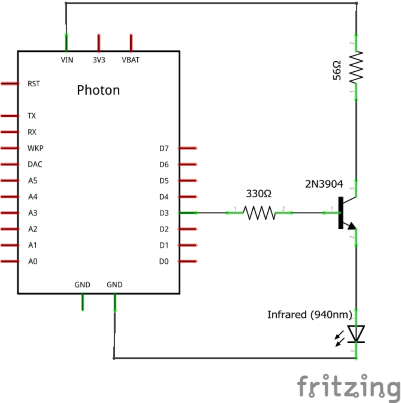
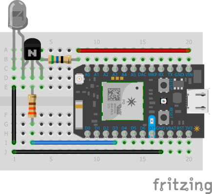

# IRelectra - Electra A/C IR library for IRremote

## This is forked from https://github.com/barakwei/IRelectra/tree/version-2.0 and adapted to work on ESP8266

### Overview
The project can be used to control Electra A/C that are common is Israel, using any dev board that supports IRremote.<br>
It doesn't has all the features that exist in the original remote, but only a subset:<br>
<ul>
<li> Whether to turn the A/C ON or OFF (A bit tricky). </li>
<li> A/C mode: cool, heat, dry, fan or auto. </li>
<li> Fan speed: low, medium, high or auto. </li>
<li> Swing: on/off. </li>
<li> Sleep mode: on/off (raise temperature by one degree every 3 hours, turn off A/C after 8 hours). </li>
</ul>

Other features like timers or "I feel" are not supported.
### Supported remotes
Currently supported remotes are RC-3/4/7 (`OrangeElectraRemote`) and YKR-M002E/3E (`GreenElectraRemote`).
The remote models are send completely different signals, and to support both of them, the library sends a for the orange remote, waits 2 seconds and send the signal for the green remote. Feel free to change that to your needs.

### IRremote
IRelectra uses IRremote to do the heavy lifting, but some IRremote implementations are better than others. For photon/spark, I recommend using my own version of IRremote located [here](https://github.com/barakwei/Photon-IRRemote). For Arduino, try the [original IRremote](https://github.com/z3t0/Arduino-IRremote).
The code will work as long as the `IRsend` class implements the `sendRaw` method as declared [here](https://github.com/shirriff/Arduino-IRremote/blob/master/IRremote.h).

### The Board
The code has been tested on [Particle Photon](www.particle.io), but should work on any dev board that has a working implementation of the IRremote library.

### Usage
```cpp
#include "IRremote.h"
#include "IRelectra.h"
  
void loop()
{
  IRsend irsend(D3);
  IRelectra e(&irsend);
  e.send(true, IRElectraModeCool, IRElectraFanLow, 24, false, false);
}
```

### The Circuit
The circuit I use is just like Sparkfun's [Max Power IR LED Kit](https://www.sparkfun.com/products/retired/10732).<br>

##### BOM
* IR Led.
* 2N3904 Transistor (or 2N2222).
* 330Ω Resistor.
* 53Ω Resistor (if you use to VIN input, with 3V3 use 22Ω).

#### Schematics



### Issues
If you have an issue/bug/question/request for feature, you can open an issue or contact me directly via email.

### Pull requests
Are welcome.

### Thanks

Big thanks for Chris from AnalysIR (http://www.analysir.com/)
